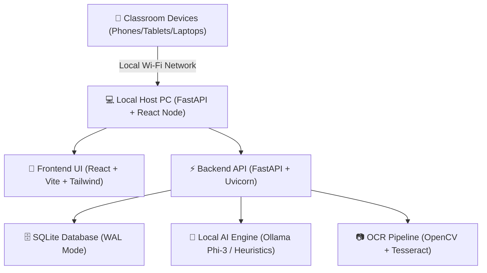

# 📚 Offline Essay Grader for Ghanaian Schools (WAEC BECE & WASSCE)
## Complete Technical Architecture, API Specification & User Manual

---

## 1. 🎯 Executive Overview & Problem Statement

In Ghanaian Junior High Schools (JHS) and Senior High Schools (SHS), evaluating student essays according to official **West African Examinations Council (WAEC)** and **Ghana Education Service (GES)** standards is labor-intensive for teachers. Furthermore, internet connectivity in remote classrooms and school computer labs is frequently unstable or unavailable.

**Essay Grader** is an **offline-first local host node application** engineered specifically for Ghanaian educators. It operates 100% offline on a teacher's PC or school LAN server, leveraging:
* **Local AI Evaluation Engines** (Ollama Phi-3 / Heuristic Fallbacks) running locally without cloud dependency.
* **Handwritten Script OCR Preprocessing** via OpenCV and Tesseract to digitize pencil/pen student compositions.
* **WAEC Letter Grade Mapping** (A1, B2, B3, C4, C5, C6, D7, E8, F9).
* **Multi-Student Ingestion & Analytics** with one-click printable PDF report cards.
* **PROSBEE-Inspired Modern UI Design System** with glassmorphism, responsive drawers, and high-contrast accessibility.

---

## 2. 🚀 Key Capabilities & Feature Matrix

| Feature Module | Description | Implementation File |
|---|---|---|
| **Educator Landing Page** | Public product showcase with WAEC feature matrix & direct workspace launch. | [LandingView.tsx](file:///c:/Users/user/Downloads/ESSAY%20GRADER/frontend/src/views/LandingView.tsx) |
| **Teacher Auth & Profiles** | Multi-teacher registration, Staff ID binding, profile switcher & 4-digit PIN lock. | [AuthModal.tsx](file:///c:/Users/user/Downloads/ESSAY%20GRADER/frontend/src/components/AuthModal.tsx) |
| **Classroom Dashboard** | Master overview of total essays, WAEC grade distributions, and recent class rosters. | [DashboardView.tsx](file:///c:/Users/user/Downloads/ESSAY%20GRADER/frontend/src/views/DashboardView.tsx) |
| **WAEC / GES Rubrics** | Configurable 50 pt (BECE) and 100 pt (WASSCE) criteria with custom weightings. | [RubricsView.tsx](file:///c:/Users/user/Downloads/ESSAY%20GRADER/frontend/src/views/RubricsView.tsx) |
| **Upload & OCR Ingestion** | Single file drag-and-drop & ZIP archive bulk class script ingestion. | [IngestionView.tsx](file:///c:/Users/user/Downloads/ESSAY%20GRADER/frontend/src/views/IngestionView.tsx) |
| **Teacher Review & Override** | Interactive score sliders, grammar highlights, and locked approval controls. | [TeacherReviewView.tsx](file:///c:/Users/user/Downloads/ESSAY%20GRADER/frontend/src/views/TeacherReviewView.tsx) |
| **Class Analytics & Export** | Criterion mastery bars, WAEC score breakdown, CSV export, and PDF report cards. | [AnalyticsView.tsx](file:///c:/Users/user/Downloads/ESSAY%20GRADER/frontend/src/views/AnalyticsView.tsx) |
| **LAN Broadcast & QR Pairing** | Wireless mobile/tablet pairing for secondary devices over classroom Wi-Fi. | [QrModal.tsx](file:///c:/Users/user/Downloads/ESSAY%20GRADER/frontend/src/components/QrModal.tsx) |
| **RSA Offline Licensing** | Hardware UUID binding & Paystack Ghana Mobile Money (MTN MoMo/Telecel) credits. | [LicenseModal.tsx](file:///c:/Users/user/Downloads/ESSAY%20GRADER/frontend/src/components/LicenseModal.tsx) |

---

## 3. 🏗️ Technology Stack & System Architecture



### **Frontend Architecture:**
* **Core:** React 18, TypeScript, Vite
* **Styling:** Vanilla CSS + TailwindCSS (Glassmorphism, Vibrant `#0070f3` branding, Dark/Light Mode)
* **Icons:** Lucide React
* **State Management:** Zustand (`useAppStore`) with persistent local storage
* **HTTP Client:** Native Fetch API wrapper (`api.ts`)

### **Backend Architecture:**
* **Framework:** Python 3.11 with FastAPI & Uvicorn
* **Database:** SQLite 3 with **Write-Ahead Logging (WAL Mode)** for high concurrency across LAN devices
* **OCR & Computer Vision:** OpenCV (`cv2`), Pillow (`PIL`), PyTesseract
* **AI Evaluation:** Ollama local HTTP REST API (`http://localhost:11434`) + Python Heuristic Rule Engine fallback
* **PDF Report Cards:** ReportLab PDF Engine

---

## 4. 🗄️ Database Schema Specification

The application uses SQLite WAL Mode located at `backend/grader.db`.

```sql
-- 1. Rubrics Table
CREATE TABLE rubrics (
    id TEXT PRIMARY KEY,
    title TEXT NOT NULL,
    subject TEXT NOT NULL,
    grade_level TEXT NOT NULL,
    description TEXT,
    total_points INTEGER NOT NULL DEFAULT 100,
    criteria JSON NOT NULL,
    is_default BOOLEAN DEFAULT 0,
    created_at TIMESTAMP DEFAULT CURRENT_TIMESTAMP
);

-- 2. Essays Table
CREATE TABLE essays (
    id TEXT PRIMARY KEY,
    title TEXT NOT NULL,
    student_name TEXT NOT NULL,
    student_id TEXT NOT NULL,
    school_name TEXT NOT NULL DEFAULT 'Achimota Basic School / JHS',
    subject TEXT NOT NULL,
    grade_level TEXT NOT NULL,
    rubric_id TEXT NOT NULL,
    file_type TEXT NOT NULL,
    file_path TEXT,
    corrected_text TEXT NOT NULL,
    word_count INTEGER DEFAULT 0,
    status TEXT NOT NULL DEFAULT 'UPLOADED'
);

-- 3. Grades Table
CREATE TABLE grades (
    id TEXT PRIMARY KEY,
    essay_id TEXT UNIQUE NOT NULL,
    rubric_id TEXT NOT NULL,
    overall_score REAL NOT NULL,
    percentage REAL NOT NULL,
    letter_grade TEXT NOT NULL, -- A1, B2, B3, C4, C5, C6, D7, E8, F9
    ai_evaluation_json JSON NOT NULL,
    final_criteria_scores_json JSON NOT NULL,
    is_approved BOOLEAN DEFAULT 0,
    approved_by TEXT,
    pdf_report_path TEXT
);
```

---

## 5. 🔌 API Endpoint Reference

### **Authentication & Security (`/api/v1/auth`)**
* `POST /api/v1/auth/verify-pin` - Verifies the 4-digit teacher security PIN.
* `POST /api/v1/auth/change-pin` - Updates active teacher PIN in system settings.

### **Essay Ingestion & OCR (`/api/v1/ingest`)**
* `POST /api/v1/ingest/upload` - Upload single script (Image, PDF, DOCX, TXT).
* `POST /api/v1/ingest/batch-upload` - Upload ZIP archive containing class submissions.
* `POST /api/v1/ingest/preprocess-image/{essay_id}` - Runs OpenCV bilateral denoise, deskew, and CLAHE contrast enhancement.

### **Teacher Review & PDF Export (`/api/v1/review`)**
* `POST /api/v1/review/evaluate/{essay_id}` - Triggers local AI/heuristic evaluation.
* `POST /api/v1/review/submit-review` - Saves teacher criteria overrides and generates PDF report card.
* `GET /api/v1/review/export-csv` - Exports complete class results as CSV.

### **LAN & System Info (`/api/v1/lan`)**
* `GET /api/v1/lan/status` - Returns local host IP, active Ollama model, and Tesseract status.

---

## 6. 🇬🇭 WAEC BECE & WASSCE Grading Scale

Calculated dynamically in `TeacherReviewView.tsx` and `backend/app/services/ocr_service.py`:

| Percentage Range | WAEC Letter Grade | Performance Classification | Badge Color |
|---|---|---|---|
| **80% - 100%** | **A1** | Excellent | Forest Emerald (`text-emerald-800 bg-emerald-100`) |
| **70% - 79%** | **B2** | Very Good | Forest Emerald (`text-emerald-800 bg-emerald-100`) |
| **65% - 69%** | **B3** | Good | Cobalt Blue (`text-blue-800 bg-blue-100`) |
| **60% - 64%** | **C4** | Credit | Cyan (`text-cyan-800 bg-cyan-100`) |
| **55% - 59%** | **C5** | Credit | Indigo (`text-indigo-800 bg-indigo-100`) |
| **50% - 54%** | **C6** | Credit | Amber (`text-amber-800 bg-amber-100`) |
| **45% - 49%** | **D7** | Pass | Orange (`text-orange-800 bg-orange-100`) |
| **40% - 44%** | **E8** | Weak Pass | Rose Red (`text-red-800 bg-red-100`) |
| **0% - 39%** | **F9** | Fail | Deep Red (`text-red-800 bg-red-100`) |

---

## 7. 🛠️ Operations & Startup Guide

### **1. Launch Backend Server:**
```bash
cd "c:\Users\user\Downloads\ESSAY GRADER\backend"
python -m uvicorn app.main:app --host 0.0.0.0 --port 8000
```

### **2. Launch Frontend Dev Server:**
```bash
cd "c:\Users\user\Downloads\ESSAY GRADER\frontend"
npm run dev
```

### **3. Run Automated System Tests:**
```bash
# Backend PyTest suite:
python backend/tests/run_tests.py

# Frontend TypeScript check:
npx tsc --noEmit
```

---

## 📜 License & Compliance
* **Developed For:** Ghana Education Service (GES) Schools & West African Examinations Council (WAEC) Assessment Workflows.
* **Offline Security:** Hardware UUID RSA Key License Validation + Local Paystack Voucher Ledger.
